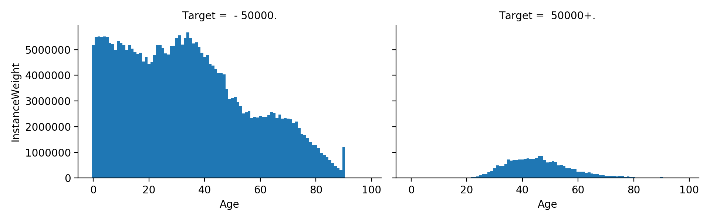
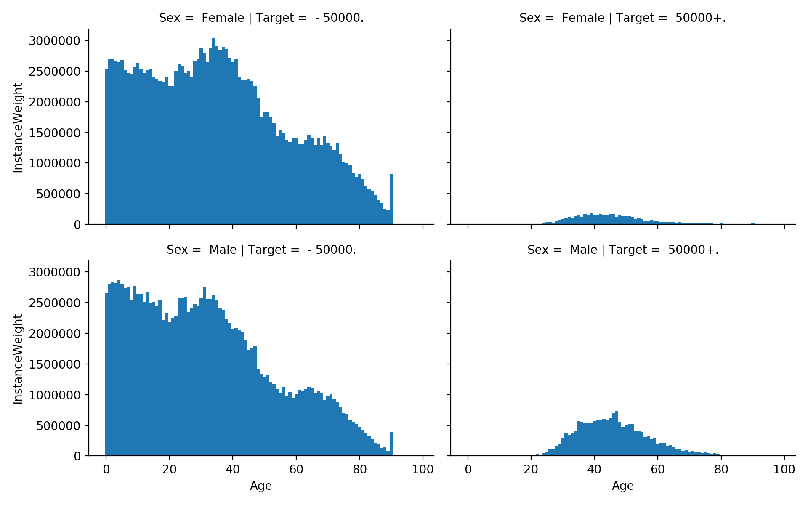

# Dataiku_Problem

The problem at hand was to model a predictor that could accurately state whether a US citizen made 
more than 50,000 dollars in terms of annual wage. The data was presented in a stratified sampling way, 
which had to be taken into account when graphing and analysing.

## Data Ingestion and Initial Thoughts

The first stage in the process was to import the data via pandas in-built csv reader as follows.

```python
train = pd.read_csv('./us_census_full/census_income_learn.csv')
test = pd.read_csv('./us_census_full/census_income_test.csv')
```

The data was found to contain no headers, so a quick use of `df.head()` and some playing around in google sheets 
led to them being created and manually added both the train and test files.

After this, an initial describing of the data was done to see the amount of missing values together with
the class split. The describe `df.describe()` produced the following results. On further inspection the data was 
found to contain many instances of `not in universe` or `?` which were then understood as being the missing values.

| FeatureName          | Initial Number Missing | Actual Missing |
|----------------------|------------------------|----------------|
| Age                  | 0                      | 0              |
| BusinessOwner        | 0                      | 0              |
| CapGains             | 0                      | 0              |
| CapLosses            | 0                      | 0              |
| Cit                  | 0                      | 0              |
| Education            | 0                      | 0              |
| EducationLastWk      | 0                      | 93.694962      |
| FamMembersU18        | 0                      | 72.288408      |
| FatherBirthCountry   | 0                      | 3.364524       |
| FullPartStat         | 0                      | 0              |
| HispOrig             | 0                      | 0              |
| HouseholdFamStat     | 0                      | 0              |
| HouseholdSummaryStat | 0                      | 0              |
| HouseLive1Yr         | 0                      | 0              |
| IndustryCode         | 0                      | 0              |
| IndustryCodeString   | 0                      | 0              |
| InstanceWeight       | 0                      | 0              |
| LabourUnion          | 0                      | 90.445212      |
| MaritalStat          | 0                      | 0              |
| MigCodeMSA           | 0                      | 50.726984      |
| MigCodeRegDiff       | 0                      | 50.726984      |
| MigCodeRegSame       | 0                      | 50.726984      |
| MigResSunbelt        | 0                      | 92.094646      |
| MotherBirthCountry   | 0                      | 3.066814       |
| NumWorkersEmployer   | 0                      | 0              |
| OccupationCode       | 0                      | 0              |
| OccupationCodeString | 0                      | 50.462353      |
| PrevReg              | 0                      | 92.094646      |
| PrevState            | 0                      | 92.449492      |
| Race                 | 0                      | 0              |
| SelfBirthCountry     | 0                      | 1.700556       |
| Sex                  | 0                      | 0              |
| StockDiv             | 0                      | 0              |
| Target               | 0                      | 0              |
| TaxFilerStat         | 0                      | 0              |
| UnempReas            | 0                      | 96.957744      |
| VeteranAdmQ          | 0                      | 99.005628      |
| VeteranBen           | 0                      | 0              |
| Wage                 | 0                      | 0              |
| WeeksWorked          | 0                      | 0              |
| WorkerClas           | 0                      | 50.242328      |
| Yr                   | 0                      | 0              |

The amount of missing data seen in certain columns will be revisited later on in this README.

Next the class split was graphed as seen in the following image.


This shows a large imbalance between the -50,000 and +50,000 classes, where 93.8% of the training examples are
of one class (-50,000). An attempt to rectify this will be seen later using 
downsampling and upsampling of the training data.

### Analyses and Correlations

Initially, a correlation plot was created for the data through the seaborn library and pandas in built `df.corr()` 
function.

```python
corr = data.corr()
hm = sns.heatmap(corr, vmin=-1, vmax=1, center=0, square=True, xticklabels=corr.columns.values, yticklabels=corr.columns.values)
plt.show()
```

Which produced the following result:


After this, the same type of graph was plotted but this time taking into consideration the top 15 variable 
correlations with respect to the target variable. 

```python
k=15
cols = corr.nsmallest(k, 'Target')['Target'].index
cm = np.corrcoef(data[cols].values.T)
sns.set(font_scale=1.25)
hm = sns.heatmap(cm, cbar=True, annot=True, square=True, fmt='.2f', annot_kws={'size': 10}, yticklabels=cols.values,
                 xticklabels=cols.values)
plt.show()
```


This gives a better idea as to what kind of relationships each individual feature has with the target variable, ideal
for us to create models that can take advantage of these correlations.

Next the continuous variables were taken into account, these being:

```
Age, Wage, CapGains, CapLosses, StockDiv, NumWorkersEmployer, WeeksWorked
```

These were placed in a seaborn pairplot as follows to check for any relationships between them.

```python
cols = ['Age', 'Wage', 'CapGains', 'CapLosses', 'StockDiv', 'NumWorkersEmployer', 'WeeksWorked']
sns.set()
sns.pairplot(data[cols], size=2.5)
plt.show()
```


### Other Analyses

Other analyses were also carried out, looking at variables with respect to the target class, to again try and 
see any relationships.

```python
# Example histogram code
sns.distplot(data['Age'], hist_kws={'weights':data['InstanceWeight']}, fit=stats.norm)
plt.figure()
# A facet grid created with a wrapper written around pyplots histogram function so as to accept InstanceWeight 
# due to stratified sampling
grid = sns.FacetGrid(data, col='Target', row='Sex', aspect=1.6)
grid.map(weighted_hist, 'Age', 'InstanceWeight', bins=np.arange(100)-0.5)
plt.show()

# the wrapper function weighted_hist
def weighted_hist(x, weights, **kwargs):
    plt.hist(x, weights=weights, **kwargs)
    plt.xticks(rotation=90)
```

The age was first graphed with respect to the target.



This was then re-graphed to take into consideration sex.



Interestingly, a large spike is seen at the extreme end of the age (~90), maybe all entries with ages larger 
than this were bunched to 90? 

The weeks worked in a year was then graphed, again with respect to the target variable.


As was expected for the 50,000+ class, as the number of weeks worked in the year increased, so did
the proportion of people earning more than 50,000 dollars.

The wage per hour feature was graphed as a distribution plot against a normal distribution, showing a large amount 
of entries as being 0. 


This entries were then removed to see the non-0 wage distribution, with the same being done here as for in previous 
features.


Surprisingly, some people earning more than 2,000 dollars per hour don't seem to make more than 50,000 dollars per
year. Could this be because they work less than 25 hours in the whole year?

Marital status was then taken into consideration.


It seems as though married people with a present spouse make up the bulk of people that earn more than 50,000 
dollars per year. 

The occupation of each citizen was also taken into consideration.


The top 4 industries, `Executive admin and managerial, Sales, Precision production craft & repair and 
Professional speciality` were then paired with the industry in question to produce the following plot.

 

Further analysis will be revisited later on in this README.

## Cleaning and Setup

Initially three columns were dropped, namely `IndustryCodeString, OccupationCodeString and InstanceWeight` the latter
of which was not needed to model. The other two contained information directly related to `IndustryCode and OccupationCode` 
and therefore could be discarded.

After this, the columns mentioned previously that consisted/contained `?` and `not in universe` were dealt with. To 
start off with, columns where more than 90% of values were those previously mentioned were discarded. When these values 
were seen to occur in less than 90% of the dataframe, the values were replaced with the next most popular result.

An example of this would be `SelfBirthCountry` where ~100,000 of the observed values were `North America` (>50%) so where
`?` was seen it was replaced with `North America`. In other cases, such as `MigCodeMSA`, where more than 90% of values 
were found to be `?`, the column was dropped entirely.

The code to accomplish this is as follows:

```python
def replaceQMarks(data):
    QCols = ['MigCodeMSA', 'MigCodeRegDiff', 'MigCodeRegSame', 'MigResSunbelt', 'FatherBirthCountry', 'MotherBirthCountry', 'SelfBirthCountry', 'PrevState']
    # QCols = ['MigCodeMSA', 'MigCodeRegDiff', 'MigCodeRegSame', 'FatherBirthCountry', 'MotherBirthCountry', 'SelfBirthCountry']
    for datum in data:
        for col in QCols:
            if datum[col].value_counts().index.to_list()[0] == ' ?':
                datum.drop(col, axis=1, inplace=True)
            else:
                # instead of removing place unknown values as most occurring within column
                datum[col] = datum[col].replace(' ?', datum[col].value_counts().index.to_list()[0])
    return data[0], data[1]
``` 

With data[0] being the train data and data[1] being that used for testing.


## Initial Modelling

Before a better look was taken at the analysis, an initial run of modelling was performed to get an idea of 
a baseline with which future models were to be compared to.

