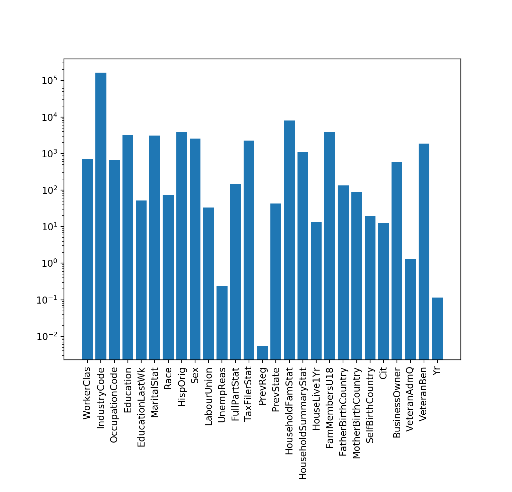

# Dataiku_Problem

The problem at hand was to model a predictor that could accurately state whether a US citizen made 
more than 50,000 dollars in terms of annual wage. The data was presented in a stratified sampling way, 
which had to be taken into account when graphing and analysing.

## Data Ingestion and Initial Thoughts

The first stage in the process was to import the data via pandas in-built csv reader as follows.

```python
train = pd.read_csv('./us_census_full/census_income_learn.csv')
test = pd.read_csv('./us_census_full/census_income_test.csv')
```

The data was found to contain no headers, so a quick use of `df.head()` and some playing around in google sheets 
led to them being created and manually added both the train and test files.

After this, an initial describing of the data was done to see the amount of missing values together with
the class split. The describe `df.describe()` produced the following results. On further inspection the data was 
found to contain many instances of `not in universe` or `?` which were then understood as being the missing values.

| FeatureName          | Initial Number Missing | Actual Missing |
|----------------------|------------------------|----------------|
| Age                  | 0                      | 0              |
| BusinessOwner        | 0                      | 0              |
| CapGains             | 0                      | 0              |
| CapLosses            | 0                      | 0              |
| Cit                  | 0                      | 0              |
| Education            | 0                      | 0              |
| EducationLastWk      | 0                      | 93.694962      |
| FamMembersU18        | 0                      | 72.288408      |
| FatherBirthCountry   | 0                      | 3.364524       |
| FullPartStat         | 0                      | 0              |
| HispOrig             | 0                      | 0              |
| HouseholdFamStat     | 0                      | 0              |
| HouseholdSummaryStat | 0                      | 0              |
| HouseLive1Yr         | 0                      | 0              |
| IndustryCode         | 0                      | 0              |
| IndustryCodeString   | 0                      | 0              |
| InstanceWeight       | 0                      | 0              |
| LabourUnion          | 0                      | 90.445212      |
| MaritalStat          | 0                      | 0              |
| MigCodeMSA           | 0                      | 50.726984      |
| MigCodeRegDiff       | 0                      | 50.726984      |
| MigCodeRegSame       | 0                      | 50.726984      |
| MigResSunbelt        | 0                      | 92.094646      |
| MotherBirthCountry   | 0                      | 3.066814       |
| NumWorkersEmployer   | 0                      | 0              |
| OccupationCode       | 0                      | 0              |
| OccupationCodeString | 0                      | 50.462353      |
| PrevReg              | 0                      | 92.094646      |
| PrevState            | 0                      | 92.449492      |
| Race                 | 0                      | 0              |
| SelfBirthCountry     | 0                      | 1.700556       |
| Sex                  | 0                      | 0              |
| StockDiv             | 0                      | 0              |
| Target               | 0                      | 0              |
| TaxFilerStat         | 0                      | 0              |
| UnempReas            | 0                      | 96.957744      |
| VeteranAdmQ          | 0                      | 99.005628      |
| VeteranBen           | 0                      | 0              |
| Wage                 | 0                      | 0              |
| WeeksWorked          | 0                      | 0              |
| WorkerClas           | 0                      | 50.242328      |
| Yr                   | 0                      | 0              |

The amount of missing data seen in certain columns will be revisited later on in this README.

Next the class split was graphed as seen in the following image.


This shows a large imbalance between the -50,000 and +50,000 classes, where 93.8% of the training examples are
of one class (-50,000). An attempt to rectify this will be seen later using 
downsampling and upsampling of the training data.

### Analyses and Correlations

Initially, a correlation plot was created for the data through the seaborn library and pandas in built `df.corr()` 
function.

```python
corr = data.corr()
hm = sns.heatmap(corr, vmin=-1, vmax=1, center=0, square=True, xticklabels=corr.columns.values, yticklabels=corr.columns.values)
plt.show()
```

Which produced the following result:


After this, the same type of graph was plotted but this time taking into consideration the top 15 variable 
correlations with respect to the target variable. 

```python
k=15
cols = corr.nsmallest(k, 'Target')['Target'].index
cm = np.corrcoef(data[cols].values.T)
sns.set(font_scale=1.25)
hm = sns.heatmap(cm, cbar=True, annot=True, square=True, fmt='.2f', annot_kws={'size': 10}, yticklabels=cols.values,
                 xticklabels=cols.values)
plt.show()
```


This gives a better idea as to what kind of relationships each individual feature has with the target variable, ideal
for us to create models that can take advantage of these correlations.

Next the continuous variables were taken into account, these being:

```
Age, Wage, CapGains, CapLosses, StockDiv, NumWorkersEmployer, WeeksWorked
```

These were placed in a seaborn pairplot as follows to check for any relationships between them.

```python
cols = ['Age', 'Wage', 'CapGains', 'CapLosses', 'StockDiv', 'NumWorkersEmployer', 'WeeksWorked']
sns.set()
sns.pairplot(data[cols], size=2.5)
plt.show()
```


### Other Analyses

Other analyses were also carried out, looking at variables with respect to the target class, to again try and 
see any relationships.

```python
# Example histogram code
sns.distplot(data['Age'], hist_kws={'weights':data['InstanceWeight']}, fit=stats.norm)
plt.figure()
# A facet grid created with a wrapper written around pyplots histogram function so as to accept InstanceWeight 
# due to stratified sampling
grid = sns.FacetGrid(data, col='Target', row='Sex', aspect=1.6)
grid.map(weighted_hist, 'Age', 'InstanceWeight', bins=np.arange(100)-0.5)
plt.show()

# the wrapper function weighted_hist
def weighted_hist(x, weights, **kwargs):
    plt.hist(x, weights=weights, **kwargs)
    plt.xticks(rotation=90)
```

The age was first graphed with respect to the target.


This was then re-graphed to take into consideration sex.


Interestingly, a large spike is seen at the extreme end of the age (~90), maybe all entries with ages larger 
than this were bunched to 90? 

The weeks worked in a year was then graphed, again with respect to the target variable.


As was expected for the 50,000+ class, as the number of weeks worked in the year increased, so did
the proportion of people earning more than 50,000 dollars.

The wage per hour feature was graphed as a distribution plot against a normal distribution, showing a large amount 
of entries as being 0. 


This entries were then removed to see the non-0 wage distribution, with the same being done here as for in previous 
features.


Surprisingly, some people earning more than 2,000 dollars per hour don't seem to make more than 50,000 dollars per
year. Could this be because they work less than 25 hours in the whole year?

Marital status was then taken into consideration.


It seems as though married people with a present spouse make up the bulk of people that earn more than 50,000 
dollars per year. 

The occupation of each citizen was also taken into consideration.


The top 4 industries, `Executive admin and managerial, Sales, Precision production craft & repair and 
Professional speciality` were then paired with the industry in question to produce the following plot.

 

Finally, the capital gains feature was graphed in a seaborn distribution plot.


Interestingly, although the -50,000 class has the majority of people having 0 or close to 0 capital gains, 
there are some people that an abnormally high capital gains (~100,000) but still are not classified as making over 
50,000 dollars per year. The other class contains a higher distribution of people having a larger capital gains which 
to be expected.

Further analysis will be revisited later on in this README.

## Cleaning and Setup

Initially three columns were dropped, namely `IndustryCodeString, OccupationCodeString and InstanceWeight` the latter
of which was not needed to model. The other two contained information directly related to `IndustryCode and OccupationCode` 
and therefore could be discarded.

After this, the columns mentioned previously that consisted/contained `?` and `not in universe` were dealt with. To 
start off with, columns where more than 90% of values were missing, together with having a low correlation score, 
were discarded. When these values were seen to occur in less than 90% of the dataframe, the values were replaced 
with the next most popular result.

An example of this would be `SelfBirthCountry` where ~100,000 of the observed values were `North America` (>50%) so where
`?` was seen it was replaced with `North America`. In other cases, such as `MigCodeMSA`, where more than 90% of values 
were found to be `?`, the column was dropped entirely.

The code to accomplish this is as follows:

```python
def replaceQMarks(data):
    QCols = ['MigCodeMSA', 'MigCodeRegDiff', 'MigCodeRegSame', 'MigResSunbelt', 'FatherBirthCountry', 'MotherBirthCountry', 'SelfBirthCountry', 'PrevState']
    for datum in data:
        for col in QCols:
            if datum[col].value_counts().index.to_list()[0] == ' ?':
                datum.drop(col, axis=1, inplace=True)
            else:
                # instead of removing place unknown values as most occurring within column
                datum[col] = datum[col].replace(' ?', datum[col].value_counts().index.to_list()[0])
    return data[0], data[1]
``` 

With data[0] being the train data and data[1] being that used for testing.

Finally, the features were converted into numerical values for our models to be able to comprehend them. This was done 
using the sklearn LabelEncoder(), with the already numerical features being ignored.

```python
def convertNominalFeatures(data):
    for datum in data:
        for col in datum.columns.values:
            if datum[col].dtype.name == 'object':
                le = LabelEncoder()
                datum[col] = le.fit_transform(datum[col])
    return data[0], data[1]
```

## Initial Modelling

Before a better look was taken at the analysis, an initial run of modelling was performed to get an idea of 
a baseline with which future models were to be compared to.

The models taken into consideration were a Logistic Regression, Decision Trees and a Random Forest. Decision Trees and 
Random Forest were both used just to see the difference ensembling makes in the final prediction accuracy. These models 
were implemented as follows:

```python
# first implementation of Logistic Regression
reg = LogisticRegression(solver='lbfgs')
reg.fit(x_data, y_data)
preds = reg.predict(x_test)
print('Accuracy Logistic Reg: ', (accuracy_score(preds, y_test)) * 100)

# first implementation of Decision Trees
d_t = DecisionTreeClassifier()
# cross val
d_t.fit(x_data, y_data)
preds = d_t.predict(x_test)
print('Accuracy DT Class: ', (accuracy_score(preds, y_test)) * 100)

# first implementation of Random Forest
rf = RandomForestClassifier()
rf.fit(x_data, y_data)
preds = rf.predict(x_test)
print('Accuracy Rand For: ', (accuracy_score(preds, y_test)) * 100)
```

Which produced the following accuracies for the test set.

| Logistic Regression | Decision Tree | Random Forest |
|---------------------|---------------|---------------|
| 94.376              | 93.017        | 95.513        |

Great initial results!

### Next Steps

#### Replacing not Removing

The first question that came to mind was the decision to drop the columns having `?` for more than 90% of the data (
ex: `MigCodeMSA`). The same initial models were kept, this time instead of dropping the columns the next most frequently 
seen value was used as a replacement much in the same way the other column's values were replaced.

```python
datum[col] = datum[col].replace(' ?', datum[col].value_counts().index.to_list()[1])
```

This time picking the second value as the first is the 'null' value (`?`), resulting in accuracies of:

| Logistic Regression | Decision Tree | Random Forest |
|---------------------|---------------|---------------|
| 94.284              | 93.091        | 95.507        |

Slight decreases in the tree models, not the desired results.

#### Keeping Features but Reducing Dimensionality

A method called multiple correspondence analysis was tried so as to see if the previously removed features would yield 
any information that could be benefitial to our models. This was done using a python package called `prince`. The reduction 
was done on the migration features, namely: `MigCodeMSA, MigCodeRegDiff, MigCodeRegSame and MigResSunbelt`. 

```python
def doMCA(data):
    QCols = ['MigCodeMSA', 'MigCodeRegDiff', 'MigCodeRegSame', 'MigResSunbelt']
    for datum in data:
        mca = prince.MCA()
        mca = mca.fit_transform(datum[QCols])
        datum['MCA1'] = mca[0]
        datum['MCA2'] = mca[1]
        datum.drop(QCols, axis=1, inplace=True)

    return data[0], data[1]
```

Producing the following results.

| Logistic Regression | Decision Tree | Random Forest |
|---------------------|---------------|---------------|
| 94.376              | 92.9          | 95.49        |


#### Engineering a New Feature - TotalGains

The capital gains was used together with capital losses and stock dividends to create a new feature called `TotalGains`. 
This was done by adding the `Stock Dividends` to the `Capital Gains` and taking away the `Capital Losses`.

After this was done the new feature was graphed with respect to the target variable.


This shows how most of the people to make over 50,000 dollars in a year have a total gain in between 10,000-50,000 dollars.
This new feature was used in place of the `CapGains`, `CapLosses` and `StockDiv` features, producing the following results.

| Logistic Regression | Decision Tree | Random Forest |
|---------------------|---------------|---------------|
| 94.297              | 92.907        | 95.335        |

Still a slight decrease, not what was wanted.

#### Engineering a New Feature - TotalWage

Since the wage per hour metric wasn't really seen to be an adequate descriptor of if a person makes more than 50,000 dollars 
per year (see Analysis part), it was used together with the number of weeks worked to create a new feature called `WageYr`. 
This was calculated by multiplying the `Wage` with the `WeeksWorked` and 40, the average number of hours spent working by 
a full time adult. The columns used to make up this new feature were dropped.

```python
datum['WageYr'] = datum['Wage'] * datum['WeeksWorked'] * 40
datum.drop(['Wage', 'WeeksWorked'], axis=1, inplace=True)
```

This was used together with the previously created `TotalGains` feature and yielded the following result.

| Logistic Regression | Decision Tree | Random Forest |
|---------------------|---------------|---------------|
| 94.13               | 92.988        | 95.357        |

Again, a slight decreased when compared to the base model results.

#### UpSampling/DownSampling

The next step was to use sklearn's `resample()` function to better balance the dataset for training. This was done as 
follows:

```python
def downSampleMajorityClass(data):
    minorityDf = data[data['Target'] == 1]
    majorityDf = data[data['Target'] == 0]

    majorityDfDownsample = resample(majorityDf, replace=False, n_samples=len(minorityDf), random_state=1)

    return pd.concat([majorityDfDownsample, minorityDf])


def upSampleMinorityClass(data):
    minorityDf = data[data['Target']==1]
    majorityDf = data[data['Target']==0]

    minorityDfUpsampled = resample(minorityDf, replace=True, n_samples=len(majorityDf), random_state=1)

    return pd.concat([minorityDfUpsampled, majorityDf])
```

Which were both tried separately and together on the original data.

##### UpSample Minority Class to Majority Class

First the minority class (>50,000) were upsampled to be of the same length as the majority class (<50,000) producing the 
following results.

(Original data)
| Logistic Regression | Decision Tree | Random Forest |
|---------------------|---------------|---------------|
| 87.245              | 93.218        | 95.141        |

(With engineered features)
| Logistic Regression | Decision Tree | Random Forest |
|---------------------|---------------|---------------|
| 87.426              | 93.142         | 95.07        |

It seems that adding so many points to the under represented class isn't such a good idea, especially for logistic 
regression.

##### DownSample Majority Class to Minority Class

The same was done but this time reducing the majority class to be of the same length as that of the minority class (around 
12,000 samples each).

(Original data)
| Logistic Regression | Decision Tree | Random Forest |
|---------------------|---------------|---------------|
| 85.63               | 81.51         | 85.84         |

(With engineered features)
| Logistic Regression | Decision Tree | Random Forest |
|---------------------|---------------|---------------|
| 84.31               | 81.328        | 85.823        |

This is even worse, as we are reducing the amount of data that the models have to learn.

#### Using both

Finally a combination of both was used, upsampling the minority class while downsampling the majority class so that 
they the lengths are the same and in between the original lengths.

(With engineered features)
| Logistic Regression | Decision Tree | Random Forest |
|---------------------|---------------|---------------|
| 86.45               | 91.416        | 94.19         |

More information therefore higher scores, but at the same time we are still removing the 'real' information and adding 
fakes by upsampling. Leading to a worse overall accuracy.

#### Further Removing >90% Null Features

Previously it was mentioned how certain columns where more than 90% of data was null were removed. This was now extended 
so that all columns were taken into consideration. If a column had more than 90% of its values as null, it was discarded.

```python
def checkRemoveMissingData(data):
    testData = data.copy()
    testData[0] = testData[0].replace(' ?', np.nan)
    testData[0] = testData[0].replace(' Not in universe', np.nan)

    # from this largest lack of testData[0] is in EducationLastWk, LabourUnion, UnempReason, PrevReg, PrevState, MigResSunbelt, VeteranAdmQ > 90% are nulls
    nullSeries = testData[0].isnull().sum()/len(testData[0]) * 100
    for item in nullSeries.iteritems():
        if item[1] >= 90:
            data[0].drop([item[0]], axis=1, inplace=True)
            data[1].drop([item[0]], axis=1, inplace=True)
    return data[0], data[1]
```

Resulting in:

| Logistic Regression | Decision Tree | Random Forest |
|---------------------|---------------|---------------|
| 94.375              | 93.12         | 95.528        |

Our first slight gain in accuracy! Now we know that no information is better than `?`. 

#### Introducing KFolds 

Here KFolds cross validation was introduced to the Logistic Regression model to see its impact on accuracy. This was 
done using sklearn's `KFolds()` and `cross_val_score()` methods.

```python
kf = KFold(n_splits=10, shuffle=True, random_state=123)
reg = LogisticRegression(solver='lbfgs', max_iter=500)
cross_val_score(reg, x_data, y_data, cv=kf)
preds = cross_val_predict(reg, x_test, y_test, cv=kf)
print('Accuracy Logistic Reg: ', (accuracy_score(preds, y_test)) * 100)
```

| Logistic Regression |
|---------------------|
| 94.59               |

The best accuracy seen so far in Logistic Regression!

#### Hyperparameter Tuning

Since the random forest model was performing the best until now, it was decided that its parameters should be tuned 
programmatically. This involved using sklearn's `RandomizedSearchCV` and `RandomForestRegressor` to iteratively go 
over different hyperparameter options and test them at each stage, keeping the one that produced the best score.

```python
def hyperParamTuningRF(x_data, y_data, x_test, y_test):
    nEstimators = [int(x) for x in np.linspace(start=200, stop=2000, num=10)]
    maxFeatures = ['auto', 'sqrt']
    maxDepth = [int(x) for x in np.linspace(10, 100, num=11)]
    maxDepth.append(None)
    minSampleSplit = [2, 5, 10]
    minSamplesLeaf = [1, 2, 4]
    bootstrap = [True, False]
    random_grid = {'n_estimators': nEstimators,
                   'max_features': maxFeatures,
                   'max_depth': maxDepth,
                   'min_samples_split': minSampleSplit,
                   'min_samples_leaf': minSamplesLeaf,
                   'bootstrap': bootstrap}
    rfReg = RandomForestRegressor(random_state=123)
    rfRand = RandomizedSearchCV(estimator=rfReg, param_distributions=random_grid, n_iter=100, cv=3, verbose=2,
                                random_state=42, n_jobs=-1)
    rfRand.fit(x_data, y_data)
    print(rfRand.best_params_)
```

Which produced the following result.

| Random Forest       |
|---------------------|
| 95.595              |

Another slight improvement!

After this experiment the random forest model was kept with these hyperparameters.

#### Going back to Feature Selection

Another, more statistics based approach was taken to selecting features. Three different feature selection methods 
were used to obtain a list of the most important features. These methods were recursive feature elimination, chi square 
test and mutual information metric. 

Chi-Square Graph Scores



Mutual Information Metric Scores


These, together with recursive feature elimination available through sklearn's `RFE` method were bunched together to 
produce a dataframe containing the 15 most important features. The results for this data are as follows:

| Logistic Regression | Decision Tree | Random Forest |
|---------------------|---------------|---------------|
| 94.13               | 94.224        | 95.212        |

Less information is worse!

### Introducing New Models

Two new models were added, namely Microsoft's LightGBM and XGBoost Gradient Boosting Models. Due to both of these models 
being tree based, some of the hyperparameters such as `n_estimators` and `max_depth` were carried over from the random 
forest model mentioned previously. These were done using the python `lightgbm` and `xgboost` packages.


